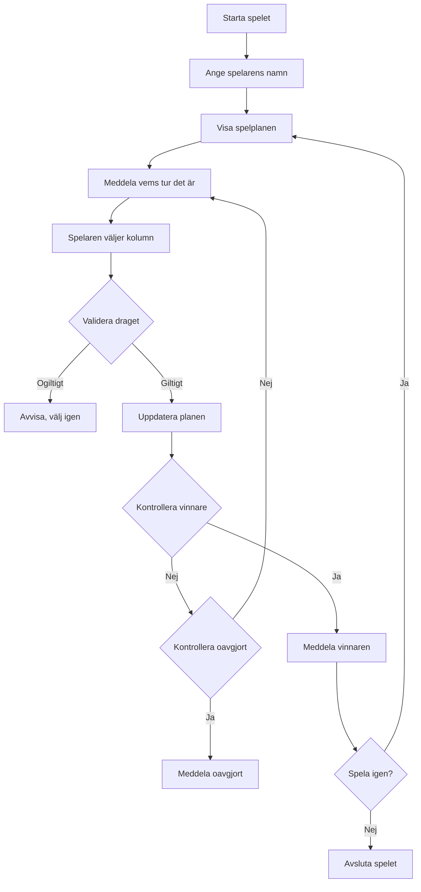

```mermaid
graph TD;
    A[Starta spelet] --> B[Ange spelarens namn];
    B --> C[Visa spelplanen];
    C --> D[Meddela vems tur det är];
    D --> E[Spelaren väljer kolumn];
    E --> F{Validera draget};
    F --> |Ogiltigt| G[Avvisa, välj igen];
    F --> |Giltigt| H[Uppdatera planen];
    H --> I{Kontrollera vinnare};
    I --> |Ja| J[Meddela vinnaren];
    I --> |Nej| K{Kontrollera oavgjort};
    K --> |Ja| L[Meddela oavgjort];
    K --> |Nej| D;
    J --> M{Spela igen?};
    M --> |Ja| C;
    M --> |Nej| N[Avsluta spelet];
```
