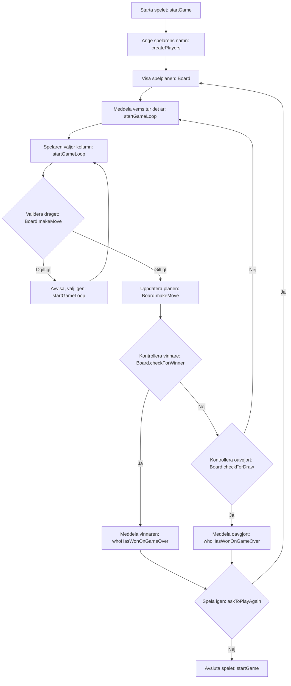

```mermaid
graph TD;
    A[Starta spelet: startGame] --> B[Ange spelarens namn: createPlayers];
    B --> C[Visa spelplanen: Board];
    C --> D[Meddela vems tur det är: startGameLoop];
    D --> E[Spelaren väljer kolumn: startGameLoop];
    E --> F{Validera draget: Board.makeMove};
    F --> |Ogiltigt| G[Avvisa, välj igen: startGameLoop];
    F --> |Giltigt| H[Uppdatera planen: Board.makeMove];
    G --> E; 
    H --> I{Kontrollera vinnare: Board.checkForWinner};
    I --> |Ja| J[Meddela vinnaren: whoHasWonOnGameOver];
    I --> |Nej| K{Kontrollera oavgjort: Board.checkForDraw};
    K --> |Ja| L[Meddela oavgjort: whoHasWonOnGameOver];
    K --> |Nej| D;
    J --> M{Spela igen: askToPlayAgain};
    L --> M;
    M --> |Ja| C;
    M --> |Nej| N[Avsluta spelet: startGame];
```
